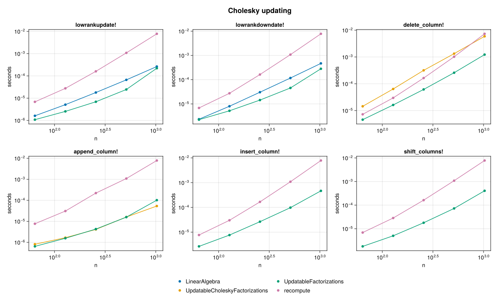
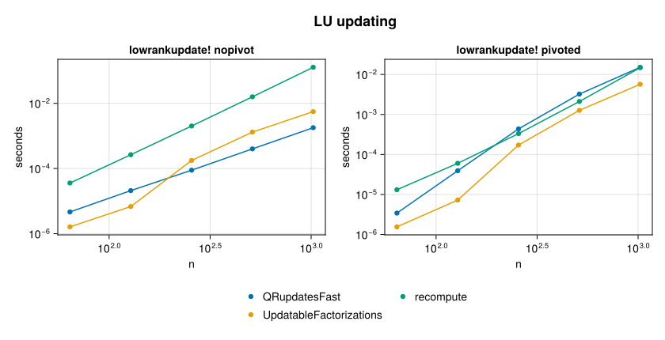
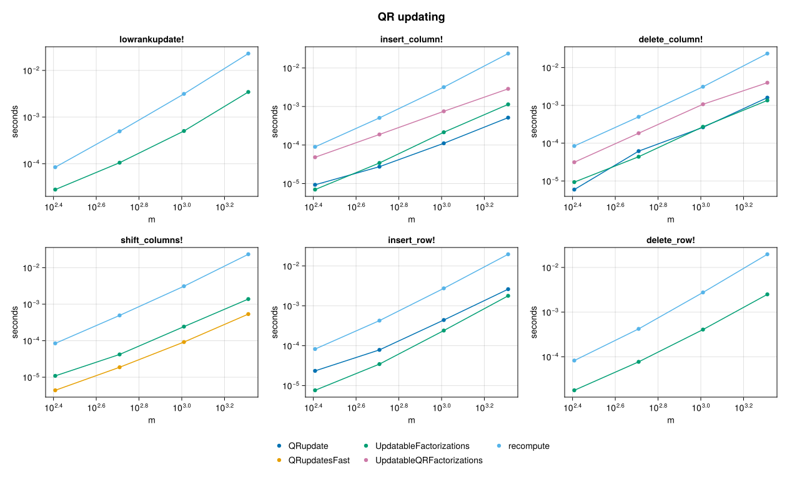

<!-- Generated by bench/plot_results.jl from bench/results. Edit the
     script, not this file. -->

# Benchmarks

Every number on this page comes from a recorded sample file under `bench/results/`, written by
`bench/updating_sweep.jl` with BLAS restricted to one thread. `bench/plot_results.jl` reads those
files and writes this page and its figures; it runs no benchmark of its own. To reproduce the
whole thing from a checkout:

    julia --project=bench bench/setup.jl
    julia --project=bench bench/updating_sweep.jl
    julia --project=bench bench/plot_results.jl

## What is compared, and which way the ratios point

Every ratio on this page is a reference time divided by the time of the row it sits next to:
**above 1.00 means that row is faster than the reference, below 1.00 means it is slower.** For
an updating verb the reference is `recompute` -- throwing the factorization away and calling
`cholesky`, `lu` or `qr` again on the modified matrix, in the "vs recomputing" column below. That
is the package's central claim: whether keeping a factorization current is worth it compared to
starting over. A verdict table precedes each family's detail table and states, per routine, the
range of that ratio across the sizes measured and at which sizes, if any, updating loses.

Two of the prior-art comparisons do a different amount of work than the row they sit next to, and
are marked wherever their numbers appear, not only here: `QRupdate` maintains `R` alone, from the
normal equations, and never forms or updates `Q`, so it does strictly less work.
`UpdatableQRFactorizations` maintains a full `m x m` `Q` where this package maintains a thin
`m x n` one, so it does strictly more work.

Building a factorization from scratch goes through `LinearAlgebra`. This package's own
construction routines run from 0.51x to 1.61x the speed of
the blocked LAPACK routine they are compared against, where 1.00 is parity: most of those cells
are slower and one is faster. See [Construction](@ref) for which routine and why.

Recorded with governor `powersave`, Julia 1.12.7, LBTConfig([ILP64] libopenblas64_.so, [LP64] libopenblas.so), 1 BLAS thread, 2026-09-10, commit `f06bb78`.

## Cholesky

| routine | worst | best | vs recomputing | vs the fastest other implementation |
| --- | --- | --- | --- | --- |
| `lowrankupdate!` | 6.32x | 44.14x | wins at every n measured | 1.19x-2.71x faster than `LinearAlgebra` |
| `lowrankdowndate!` | 3.04x | 27.67x | wins at every n measured | 1.05x-2.57x faster than `LinearAlgebra` |
| `delete_column!` | 1.58x | 5.97x | wins at every n measured | 3.15x-5.15x faster than `UpdatableCholeskyFactorizations` |
| `append_column!` | 11.92x | 77.08x | wins at every n measured | 0.53x-1.26x of `UpdatableCholeskyFactorizations`, slower at n = 256, 1024 |
| `insert_column!` | 2.88x | 16.81x | wins at every n measured | no other implementation measured |
| `shift_columns!` | 3.85x | 19.20x | wins at every n measured | no other implementation measured |

## LU

| routine | worst | best | vs recomputing | vs the fastest other implementation |
| --- | --- | --- | --- | --- |
| `lowrankupdate! nopivot` | 28.58x | 278.57x | wins at every n measured | 3.21x-5.89x faster than `QRupdatesFast` |
| `lowrankupdate! pivoted` | 10.02x | 32.98x | wins at every n measured | 2.60x-40.24x faster than `QRupdatesFast` |

## QR

| routine | worst | best | vs recomputing | vs the fastest other implementation |
| --- | --- | --- | --- | --- |
| `lowrankupdate!` | 4.00x | 10.17x | wins at every m measured | no other implementation measured |
| `insert_column!` | 20.52x | 43.65x | wins at every m measured | 0.75x-2.37x of `QRupdate` (which maintains `R` only, never `Q`), slower at m = 2048 |
| `delete_column!` | 12.12x | 21.78x | wins at every m measured | 0.87x-1.71x of `QRupdate` (which maintains `R` only, never `Q`), slower at m = 256 |
| `shift_columns!` | 16.63x | 37.53x | wins at every m measured | 0.55x-1.06x of `QRupdatesFast`, slower at m = 256, 1024, 2048 |
| `insert_row!` | 16.84x | 27.47x | wins at every m measured | 1.91x-4.94x faster than `QRupdate` (which maintains `R` only, never `Q`) |
| `delete_row!` | 6.34x | 11.91x | wins at every m measured | no other implementation measured |
